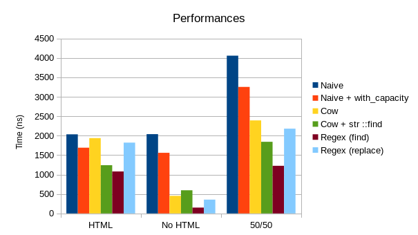
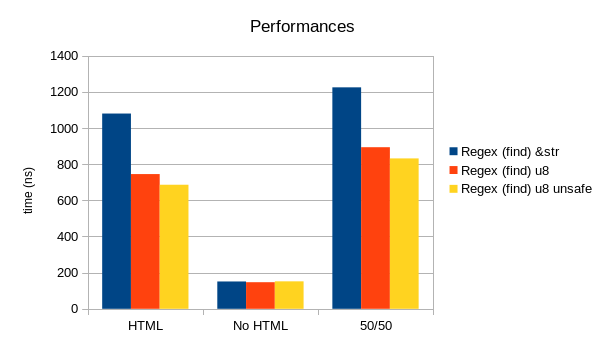
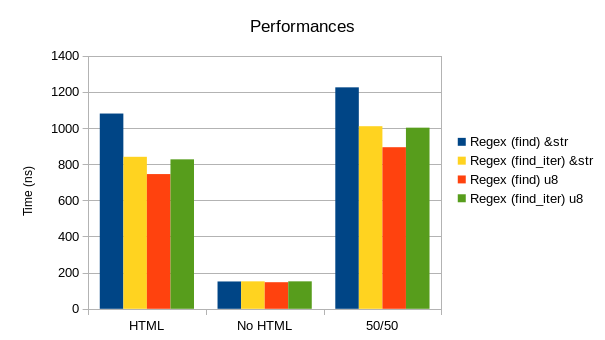
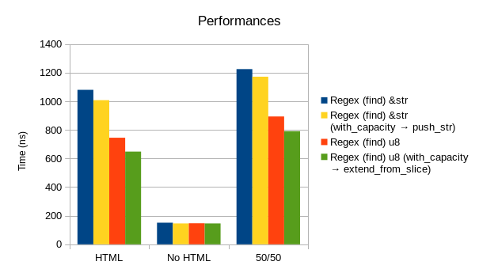
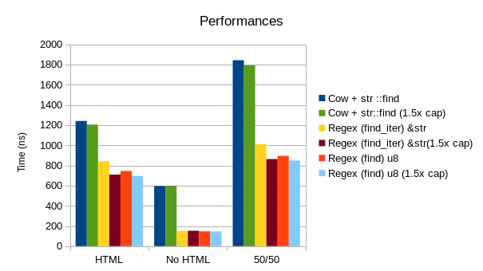
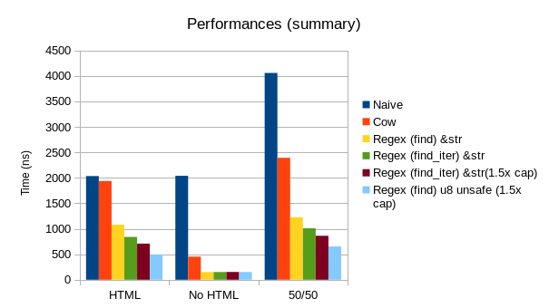

Optimising string processing in Rust
=========================

In this article, I'd like to explore how to process strings faster in
Rust. I'll take the example of a function to escape the HTML `<`, `>`
and `&` characters, starting from a naive implementation and trying to
make it faster.

> **Warning**: I'm not an expert in this domain. While I do have a computer
> science background, I haven't had a job in this domain for nearly
> ten years, I am not an expert of Rust, and certainly not an expert
> in optimising stuff, so I'm absolutely not saying that I'm going to
> show you the fastest way to solve this problem; I mainly wanted to
> share my experience and what I learned by looking at that.

The problem
-----------

The problem is, broadly speaking, the following: we have a string
containing some text, we want to do some stuff to it in some
circumstances, and return another string. I'll take the specific
example of escaping HTML characters: we don't want the text we are
displaying to cause problem in our browser, so we escape the following
characters:

* `<` to `&lt;`
* `>` to `&gt;`
* `&` to `&amp;`

> We are only escaping those because we assume non-adversarial
> content (the use case is converting local markdown files to HTML);
> clearly, more rules would be needed if we wanted to escape the input
> of a non trusted user, in which case it might be a good idea to use
> an existing library that prevents e.g. XSS attacks.


The naive implementation
-----------------------

Let's start with a naive implementation, which is what I began with:

```rust
pub fn naive(input: &str) -> String {
    let mut output = String::new();
    for c in input.chars() {
        match c {
            '<' => output.push_str("&lt;"),
            '>' => output.push_str("&gt;"),
            '&' => output.push_str("&amp;"),
            _ => output.push(c)
        }
    }
    output
}
```

This function takes a `&str` reference and returns a newly allocated
`String`, where the characters are escaped. It proceeds simply:
allocate a new `String` at the beginning, walk through each character,
escape it if it needs to be, or copy it if it doesn't. It works, but
let's test 
how fast it is. 

In order to do so, we'll use
the
[bencher](https://doc.rust-lang.org/beta/book/benchmark-tests.html)
facility of Rust, which unfortunately requires a nightly
compiler. We'll test this function on four strings, hoping they
reflect the way this function is used in real life:

* two that *don't* contain any characters that needs to be escaped,
  one being a short paragraph of 60 chars, and the other a longer one
  of 200 chars;
* two that contain characters that need to be escaped, the first one
  being a short paragraph of 60 chars with quite a lot of characters
  to escape, and the other being a longer paragraph of 200 chars with
  only one character to escape.
  
In particular, we want to separate the cases where escaping is needed
and the ones where it isn't. Indeed, in typical use case, most of the
time the escape function won't actually have to do anything.

The results of running `cargo bench` (the source code for these benchmarks
is [available on Github](https://github.com/lise-henry/bench-escape))
is the following: 

```
test bench_naive_all      ... bench:  4,551 ns/iter (+/- 103)
test bench_naive_html     ... bench:  2,171 ns/iter (+/- 49)
test bench_naive_no_html  ... bench:  2,155 ns/iter (+/- 26)
```

Unsurprisingly, the results for strings containing characters that
need to be escaped and strings that are free of it are similar. Since
Rust is a compiled language
that [*runs blazingly fast*](https://www.rust-lang.org/), even the
naive implementation isn't that bad: it takes around 4.5 microseconds
to process a bit more than 500 characters; a novel of 500 thousands
characters (not *A Song of Ice and Fire* volume, but not that short
either) would thus require around 5 milliseconds. This isn't blocking
for my needs, but we can do better, so let's do it.


Using `with_capacity`
----------------------

So, let's just start by changing one line of code, and instead of
writing:

```rust
let mut output = String::new();
```

which create an empty string, let's allocate upfront roughly enough
capacity to store the whole text that we need to store, at least if we
don't do any modification on it:

```rust
let mut output = String::with_capacity(input.len());
```

We now have:

```
test bench_naive_capacity_html    ... bench: 1,698 ns/iter (+/- 19)
test bench_naive_capacity_no_html ... bench: 1,565 ns/iter (+/- 21)
test bench_naive_capacity_all     ... bench: 3,243 ns/iter (+/- 56)
```

So, our function is now 30% faster, just by changing one line of code,
because we avoid multiple allocations of the string when we know it's
going to be at least this size.

But we can do better: looking at those results, we see that it takes
nearly as much time when the function actually does *nothing* (when
there isn't any character to escape). Can't we just avoid the work in
that case?

Using `Cow`
-----------

It turns out we can, quite easily, by
using [Cow](https://doc.rust-lang.org/std/borrow/enum.Cow.html). While
I like that it bears the name of a pleasant animal, `Cow` actually
means `Copy On Write`. As long as you don't need to modify it, it's
actually just a pointer to some data, and if you need to modify it and
only then, you can allocate an owned object.

So, instead of returning a `String`, we'll return a `Cow<str>`. If we
modify the input string, the result will actually be a `String`, but
if we do nothing (there are no characters that need to be escaped), we
just return what we were given:

```rust
pub fn naive<'a, S: Into<Cow<'a, str>>>(input: S) -> Cow<'a, str> {
    let input = input.into();
    fn is_trouble(c: char) -> bool {
        c == '<' || c == '>' || c == '&'
    }

    if input.contains(is_trouble) {
        let mut output = String::with_capacity(input.len());
        for c in input.chars() {
            match c {
                '<' => output.push_str("&lt;"),
                '>' => output.push_str("&gt;"),
                '&' => output.push_str("&amp;"),
                _ => output.push(c)
            }
        }
        Cow::Owned(output)
    } else {
        input
    }
}
```

This function might look a bit complicated because of its argument,
but it mainly uses
the [`Into`](https://doc.rust-lang.org/std/convert/trait.Into.html)
trait to be able to take a wider varieties of arguments. This way, it
is still possible to call this function by passing a `&str` to it, or
a `String` if we already have an allocated one. 

For a nice introduction on the `Into` trait, see [Creating a Rust
function that accepts String or &str](http://hermanradtke.com/2015/05/06/creating-a-rust-function-that-accepts-string-or-str.html);
you can also read the next article in this
series,
[Creating a Rust function that returns a &str or String](http://hermanradtke.com/2015/05/29/creating-a-rust-function-that-returns-string-or-str.html) that
explains `Cow<str>`. These two articles really helped me understand
those two powerful concepts of the Rust language, so if you need more
explanation on this, I'd rather refer you to them instead of trying to
paraphrase them.

Anyway, let's see if this improved our performances:

```rust
test bench_naive_cow_html     ... bench: 1,959 ns/iter (+/- 36)
test bench_naive_cow_no_html  ... bench:   443 ns/iter (+/- 5)
test bench_naive_cow_all      ... bench: 2,412 ns/iter (+/- 51)
```

Alright, this implementation is actually a tad *slower* when it is
working on strings that need to be escaped, but in counterpart, it is
now *three times faster* on strings that don't contain any. On a 50/50
mixture of both, it's 25% faster, but I'd think that the global number
doesn't really mean anything, at it will depend on the actual content
of your file. I'd tend to think, however, that in most cases you
*won't* have any characters to escape[^1].


[^1]: At least in my use case, where this function is called on any
paragraph, title, subsection of text that is emphasised, and so
on. Clearly, this would be different if you only ran this function
once on the content of a whole document.


The name of this test and function, containing the name `naive`, might
be a spoiler alert: if it is naive, can we still do better? Of course we can.


Using `find` instead of `contains`
-------------------------------

This function is nice when it doesn't need to do anything, but it
comes at a cost when it needs to do something: we call
`input.contains`, which will walk the string looking for characters
that need to be escaped, and then we will walk it *again* to replace
those characters.

We can, however, use `find` instead:

```rust
pub fn find<'a, S: Into<Cow<'a, str>>>(input: S) -> Cow<'a, str> {
    let input = input.into();
    fn is_trouble(c: char) -> bool {
        c == '<' || c == '>' || c == '&'
    }
    let first = input.find(is_trouble);
    if let Some(first) = first {
        let mut output = String::from(&input[0..first]);
        output.reserve(input.len() - first);
        let rest = input[first..].chars();
        for c in rest {
            match c {
                '<' => output.push_str("&lt;"),
                '>' => output.push_str("&gt;"),
                '&' => output.push_str("&amp;"),
                _ => output.push(c),
            }
        }

        Cow::Owned(output)
    } else {
        input.into()
    }
}
```

Unlike `contains`, `find` also returns the position of the first
character that matches its pattern. With that information, we can
directly jump to this position knowing that, before it, there was no
need for escaping, and create the new string from this substring instead of copying
one character at a time.

```rust 
test bench_cow_find_html    ... bench: 1,282 ns/iter (+/- 23)
test bench_cow_find_no_html ... bench:   613 ns/iter (+/- 4)
test bench_cow_find_all     ... bench: 1,896 ns/iter (+/- 35)
```

This modification has a slight cost when there are no characters to be
escaped, as it is 40% slower than the previous `Cow` implementation
(but still more than two times faster than the implementation without
`Cow`). On the other hand, it's 35% faster when the strings actually
needs to be modified. While the percentages might look in favour of
the precedent implementation, the absolute values clearly don't.

### Is it better or worse? ###

It's hard, in these conditions, to clearly know what of these two
implementations is the best, and it shows the limits of such a simple
benchmark. The previous implementation was better for texts that
contain few characters that needs to be escaped, while this new one is
better for texts that contain more. I'd say that the 1300/600ns
variant is globally better than the 2000/440ns one, but it really
depends on which type of texts you are processing, and if it was
really critical, you'd probably want to collect a vast corpus of texts
to have more data.

Or... use another implementation anyway?


Using Regex
------------

There's this nice crate, [Regex](https://crates.io/crates/regex), that
provides an implementation of regular expressions. Now, clearly, for
such a simple case where there are only three characters to be
detected, using `find` plus a function (or a closure) seems way
simpler, and I really don't see why adding a whole new machinery for
such a trivial case would be faster, but let's test it anyway.

Of course, we need to add some dependencies to our `Cargo.toml`, and
rewrite our function a little:

```rust
pub fn find<'a, S: Into<Cow<'a, str>>>(input: S) -> Cow<'a, str> {
    lazy_static! {
        static ref REGEX: Regex = Regex::new("[<>&]").unwrap();
    }
    let input = input.into();
    let first = REGEX.find(&input);
    if let Some((first, _)) = first {
        // The rest is identical to the previous version
		// ...
    } else {
        input.into()
    }
}
```

Alright, so instead of having a function that returns `true` if there
is a `<`, a `>` or a `&`, we just have a `Regex` that does the same
thing, and instead of using the `find` method of `str` we use the
`find` method of `Regex`, which returns a similar result (except it
gives us the beginning and the end instead of just the beginning, but
we discard this new piece of information anyway).

How good can that be? 

```
test bench_regex_html    ... bench: 1,067 ns/iter (+/- 15)
test bench_regex_no_html ... bench:   151 ns/iter (+/- 1)
test bench_regex_all     ... bench: 1,233 ns/iter (+/- 38)
```

*Great Scott!* This is actually *three times* faster than the fastest
implementation when there is no characters to escape, and still 30%
faster than the fastest implementation when there are characters to
escape. I guess we don't have to choose anymore between the two
previous implementations because... *wow*, `Regex` is *fast*.

### What's this lazy_static stuff? ###

Honestly, in this implementation, I just copy/pasted the
`lazy_static!` block from the example
in
[Regex documentation](https://doc.rust-lang.org/regex/regex/index.html) (because
not only is it fast, it also has a good documentation). `lazy_static!`
is a macro that allows to declare a static variable that will only get
initialised once, allowing to avoid to recompile the regular
expression each time the function is invoked. The regex documentation
warns:

> It is an anti-pattern to compile the same regular expression in a
> loop since compilation is typically expensive. 

But what if we are too lazy to use `lazy_static!` and instead simply
use the following?

```rust
let regex: Regex = Regex::new("[<>&]").unwrap();
```

Let's see...

```
test bench_regex_no_static_html    ... bench: 38,472 ns/iter (+/- 773)
test bench_regex_no_static_no_html ... bench: 37,654 ns/iter (+/- 675)
test bench_regex_no_static_all     ... bench: 76,458 ns/iter (+/- 1,923)
```

Alright. Let's *not* do that.

Using `Regex::replace_all`
----------------------

But wait a second, if `Regex` is that fast, why not use its
`replace_all` method to do all the work, instead of just using `find`
and then walking char by char through the rest of the string? Let's
try it:

```rust
pub fn replace(input: &str) -> String {
    lazy_static! {
        static ref REGEX: Regex = Regex::new("[<>&]").unwrap();
    }
    let output = REGEX.replace_all(input, |caps: &Captures| {
        match caps.at(0).unwrap() {
            "<" => "&lt;".to_owned(),
            ">" => "&gt;".to_owned(),
            "&" => "&amp;".to_owned(),
            _ => unreachable!()
        }
    });
    output
}
```

Here, we use the `replace_all` method, which takes as parameter a
closure taking a `Captures` and returning a `String`. The element `0`
of `Captures` corresponds to the whole match, so we then insert here
the `match` block we previously had in our `for` loop. Also, since we
don't differentiate anymore whether we find some characters that must be
escaped or not, we removed all the `Cow`s (*moo*), so this function
goes back to taking a `&str` and returning a `String`.

The results, however, aren't as good as the previous implementation:

```
test bench_regex_replace_html    ... bench: 1,828 ns/iter (+/- 36)
test bench_regex_replace_no_html ... bench:   360 ns/iter (+/- 11)
test bench_regex_replace_all     ... bench: 2,196 ns/iter (+/- 75)
```

It is two times slower than the implementation only using `find`.


> **Warning**: I don't know a lot about regular expressions, so it is
> entirely possible that this call to `replace_all` could be optimised
> and that it is actually worth using this method instead of
> `find`, but if it is, it requires more competences than I currently
> have.


Finally, the chart
---------------------

To sum it up in a picture, here is a chart of the performances of all
these implementations (except Regex without lazy static, which clearly
is not the way you are supposed to use it). Time is in nanosecond per
iteration, and, obviously, the lower the better.



To conclude:

* using a good implementation instead of the naive one actually has
  huge performances issues, not a mere 10% factor;
* the real improvement is actually when you *don't need to do
  anything*, and I think this can apply to a broad range of string
  manipulations (removing unnecessary whitespaces, using typographic
  quotation marks, replacing `:)` with 😁 and so on...);
* *wow*, `Regex` is fast.

Post-scriptum: additional optimisations
------------------------------------------

Posting this article on
the
[Rust reddit](https://www.reddit.com/r/rust/comments/55wpxh/optimising_string_processing_in_rust/) provided
a lot of interesting feedback, and many people suggested further optimisations.

### Using `u8` instead of `chars` ###

> While I wasn't initially sure it was safe, and thus avoided doing
> it, I was told that it's possible to safely search for
> ASCII characterss in a slice of 
> `u8`, since the leading bit is set to `1` if it isn't the first byte
> of a character. 

It is therefore possible to optimise the algorithm in this current
case by looking directly at the bytes (`u8`) of the strings instead of
the chars:

```rust
pub fn find_u8<'a, S: Into<Cow<'a, str>>>(input: S) -> Cow<'a, str> {
    lazy_static! {
        static ref REGEX: Regex = Regex::new("[<>&]").unwrap();
    }
    let input = input.into();
    let first = REGEX.find(&input);
    if let Some((first, _)) = first {
        let mut output:Vec<u8> = Vec::from(input[0..first].as_bytes());
        output.reserve(input.len() - first);
        let rest = input[first..].bytes();
        for c in rest {
            match c {
                b'<' => output.extend_from_slice(b"&lt;"),
                b'>' => output.extend_from_slice(b"&gt;"),
                b'&' => output.extend_from_slice(b"&amp;"),
                _ => output.push(c),
            }
        }
        Cow::Owned(String::from_utf8(output).unwrap())
    } else {
        input.into()
    }
}
```

This leads to a significant performance bump when having to escape
characters:

```
test bench_regex_u8_html    ... bench: 745 ns/iter (+/- 19)
test bench_regex_u8_no_html ... bench: 147 ns/iter (+/- 0)
test bench_regex_u8_all     ... bench: 894 ns/iter (+/- 19)
```

> Note, however, that this only works because the characters that we
> want to escape, `<`, `>`, and `&` are ASCII characters. Unlike the other
> methods described previously, this one cannot be generalized for any
> UTF-8 character.

It is possible to go a step further, by using the unsafe
method
[`String::from_utf8_unchecked`](https://doc.rust-lang.org/std/string/struct.String.html#method.from_utf8_unchecked) since
we know that the vector of bytes we constructed is valid unicode,
replacing

```rust
Cow::Owned(String::from_utf8(output).unwrap())
```

with 

```rust
Cow::Owned(unsafe { String::from_utf8_unchecked(output) })
```

Since we don't have to check that the vector of `u8` is valid UTF-8,
we have a little gain:

```
test bench_regex_u8_unsafe_html    ... bench: 686 ns/iter (+/- 18)
test bench_regex_u8_unsafe_no_html ... bench: 152 ns/iter (+/- 2)
test bench_regex_u8_unsafe_all     ... bench: 842 ns/iter (+/- 29)
```

> This requires using the `unsafe` keyword, which means you need to
> know what you are doing. While on this particular case, this function is
> small enough to be reasonably certain that nothing is going to go
> badly, I'd be more reluctant to use this feature in a complex
> function, or in code that might evolve later on.




### Using `Regex::find_iter` ###

In our main loop, we still walk through each character (or each byte
with the version that works on bytes). It is, however, possible to use
the `find_iter` method of `Regex` to get a list of matches and insert
the substrings between the matches in one step:

```rust
pub fn find_iter<'a, S: Into<Cow<'a, str>>>(input: S) -> Cow<'a, str> {
    lazy_static! {
        static ref REGEX: Regex = Regex::new("[<>&]").unwrap();
    }
    let input = input.into();
     let mut last_match = 0;

    if REGEX.is_match(&input)
    {
        let matches = REGEX.find_iter(&input);
        let mut output = String::with_capacity(input.len());
        for (begin, end) in matches {
            output.push_str(&input[last_match..begin]);
            match &input[begin..end] {
                "<" => output.push_str("&lt;"),
                ">" => output.push_str("&gt;"),
                "&" => output.push_str("&amp;"),
                _ => unreachable!()
            }
            last_match = end;
        }
        output.push_str(&input[last_match..]);
        Cow::Owned(output)
    } else {
        input
    }
}
```

In this case, there is an additional call to `REGEX.is_match` (which
returns a boolean) which might not strictly be necessary, but is there
to appease the borrow checker (`matches` is returned from `find_iter`
which borrows `input`, so the compiler isn't happy with us returning
`input` if `matches` is in the same scope). Despite that, it's still a
performance gain compared to the implementation only using `find`:

```
test bench_regex_html         ... bench: 1,072 ns/iter (+/- 19)
test bench_regex_iter_html    ... bench:   841 ns/iter (+/- 26)
test bench_regex_no_html      ... bench:   152 ns/iter (+/- 2)
test bench_regex_iter_no_html ... bench:   155 ns/iter (+/- 2)
test bench_regex_all          ... bench: 1,222 ns/iter (+/- 38)
test bench_regex_iter_all     ... bench: 1,010 ns/iter (+/- 19)
```

The same idea can be applied for the implementation working on bytes
but in this case (and on this set of data), it is actually slightly
slower, probably because walking through a slice of bytes can be much
more optimised than having to find the next unicode character, so the
overhead isn't worth it:

```
test bench_regex_u8_html         ... bench:   751 ns/iter (+/- 46)
test bench_regex_u8_iter_html    ... bench:   827 ns/iter (+/- 22)
test bench_regex_u8_no_html      ... bench:   147 ns/iter (+/- 3)
test bench_regex_u8_iter_no_html ... bench:   152 ns/iter (+/- 2)
test bench_regex_u8_all          ... bench:   897 ns/iter (+/- 29)
test bench_regex_u8_iter_all     ... bench: 1,002 ns/iter (+/- 17)
```



### Using `with_capacity` instead of `reserve` ###

Initially (except in the most naive case), I was initialising the
output string with:

```rust
String::with_capacity(input.len())
```

Later on, on some versions, I initialised this `String` (or this
`Vec<u8>`) with the content of `input` until the first character to escape, using
`reserve` next to allocate more memory:

```rust
let mut output = String::from(&input[0..first]);
output.reserve(input.len() - first);
```

or 

```rust
let mut output:Vec<u8> = Vec::from(input[0..first].as_bytes());
output.reserve(input.len() - first);
```

Ideally, I would have used something like 

```rust
let mut output = String::from_with_capacity(&input[0..first],
input.len());
```

But there is no method `from_with_capacity`, so I had to do it in two
steps. I was suggested to to it in the opposite order, in order to
avoid an unnecessary allocation:

```rust
let mut output = String::with_capacity(input.len());
output.push_str(&input[0..first]);
```

```rust
let mut output:Vec<u8> = Vec::with_capacity(input.len());
output.extend_from_slice(input[0..first].as_bytes());
```

The results turn out to be, indeed, slightly faster:



So, the morale seems to be, set capacity first, load content later.


### Setting a larger initial capacity ###

When we create our output string, we use
`String::with_capacity(input.len())`. Except... since we are replacing
single characters with four of five character strings (`>`-> `&gt;`, `<` -> `&lt;`, `&`
-> `&amp;`), the output string will be larger than the
initial one. This is bad because we'll need to have one more
allocation, and it's possible that, in this process, the compiler will have to copy the
entire string we have been building to a new memory location.

So, we should set the initial capacity to a bigger
number. Doing this is straightforward, as it just requires to replace: 

```rust
let mut output = String::with_capacity(input.len());
```

by:

```rust
let len = input.len();
let mut output = String::with_capacity(len + len/2);
```

(Why add 50%, and not 10%, or double it? Well, I cheated a bit, and
looked at the limited strings that I use to bench this function, and
the worst case scenario added a bit less than 50% to the string
length. Obviously, for real use cases, you probably have to rely a bit
more on guessing.)

The performance gain is significant, e.g. for the implementation using
`Regex::find_iter`:

```
test bench_regex_iter_html            ... bench: 832 ns/iter (+/- 24)
test bench_regex_iter_morecap_html    ... bench: 702 ns/iter (+/- 16)
test bench_regex_iter_no_html         ... bench: 150 ns/iter (+/- 5)
test bench_regex_iter_morecap_no_html ... bench: 150 ns/iter (+/- 1)
test bench_regex_iter_all             ... bench: 995 ns/iter (+/- 29)
test bench_regex_iter_morecap_all     ... bench: 846 ns/iter (+/- 11)
```

A similar modification on other implementation yields similar results:



### And the winner is... ###

So, with all those options, what is the fastest? Currently, at least
on my computer, the fastest was the following, using `Regex`, then
walking through the slice of bytes, using an initial capacity of 1.5
the length of the input string, and using
`String::from_utf8_unchecked` to generate the output string:

```rust
pub fn find_u8_unsafe_morecap<'a, S: Into<Cow<'a, str>>>(input: S) -> Cow<'a, str> {
    lazy_static! {
        static ref REGEX: Regex = Regex::new("[<>&]").unwrap();
    }
    let input = input.into();
    let first = REGEX.find(&input);
    if let Some((first, _)) = first {
        let len = input.len();
        let mut output:Vec<u8> = Vec::with_capacity(len + len/2);
        output.extend_from_slice(input[0..first].as_bytes());
        let rest = input[first..].bytes();
        for c in rest {
            match c {
                b'<' => output.extend_from_slice(b"&lt;"),
                b'>' => output.extend_from_slice(b"&gt;"),
                b'&' => output.extend_from_slice(b"&amp;"),
                _ => output.push(c),
            }
        }
        Cow::Owned(unsafe { String::from_utf8_unchecked(output) })
    } else {
        input
    }
}
```

Getting the following results:

```
test bench_regex_u8_unsafe_morecap_html    ... bench: 497 ns/iter (+/- 14)
test bench_regex_u8_unsafe_morecap_no_html ... bench: 152 ns/iter (+/- 2)
test bench_regex_u8_unsafe_morecap_all     ... bench: 653 ns/iter (+/- 13)
```

While these results are nice, they require the use of `unsafe` and
working on bytes (which might not be possible for more generic string
processing). 


### Post-scriptum conclusion ###

We have gone a long way from our naive approach. But looking at the
results:



I'd argue that the major performance improvements were:

* avoid doing work when there is no work to do (using `Cow`);
* using `Regex::find` instead of the standard library method on `str`,
  which, at least currently, isn't as fast.

There was room for more improvement after that (either using `Regex::find_iter`,
tweaking the initial capacity, or working on bytes instead of chars)
but it wasn't by the same order of magnitude. 

### Thanks ###

I'd like to thank everyone who commented on
the
[Rust reddit thread on this article](https://www.reddit.com/r/rust/comments/55wpxh/optimising_string_processing_in_rust/) and
in particular
`burntsushi`, `TaslemGuy`, `dbaupp`, `SimonSapin`, `tspiteri`, `LEmp_Evrey`, and I'm probably
forgetting people.
