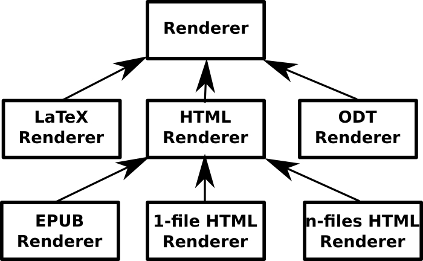

Simulating inheritance in Rust 
==============================

Context 
-------

[Crowbook](https://github.com/lise-henry/crowbook) is a tool that
renders Markdown books (or articles) to HTML, Epub and PDF. In summary
it works like this.

First, a parser (using
[pulldown-cmark](https://crates.io/crates/pulldown-cmark)) reads all
the Markdown files and outputs some kind of AST (Abstract Syntax
Tree), which is basically a list of `Token`s, which look like
this:

```rust
enum Token {
    Str(String),
    Paragraph(Vec<Token>),
    Header(i32, Vec<Token>),
    Emphasis(Vec<Token>),
    ...
}
```

Then, a `Book` groups all the ASTs corresponding to each Markdown
file, information about the book options (author, title, where to
ouput the files, and so on).

Finally, the book is rendered in various formats, using different
renderers. There are currently 5 different renderers:

* `LatexRenderer` renders to text;
* `OdtRenderer` renders to Odt (well, it doesn't really, because it
doesn't really work currently, but the renderer exists anyway);
* `HtmlRenderer` renders to a single, self-contained HTML file;
* `HtmlDirRenderer` renders to multiple HTML files;
* `EpubRenderer` renders to an Epub file.

Now, let's look at the last three. Obviously, they share much of their
job, because they all deal with generating HTML, and, for most
variants of `Token`, they generate exactly the same code (the only necessary
differences are for `Link`s, since internal links must be a bit tweaked to work when there are
multiple files. and for `Image`s, which are included as base64 code in
the single self-contained file).

The object-oriented solution
----------------------------

Now, had I written Crowbook in an object-oriented programming
language, I would have had an obvious solution in mind: define a
`Renderer` interface or abstact class, then have all renderers
implement it/extend it. Then I guess I could have all three HTML-based
renderers derive from a common class. So, basically, something like
this ugly pseudo-UML graph:



The current status
------------------

### A Renderer trait ###

Now, Rust isn't object-oriented, so you can't really do that. There
are, however, traits, that are more or less similar-ish to interfaces
in Java. So, all Renderers can implement a `Renderer` trait. And,
what's cool is that traits can have default implementations, so we
can avoid duplicating code:

```rust
trait Renderer {
    fn render_token(&mut self, token: &Token) -> Result<String>;
    fn render_vec(&mut self, tokens: &[Token]) -> Result<String> {
        tokens.iter()
            .map(|token| self.render_token(token))
            .collect::<Result<Vec<_>>>()
            .map(|vec| vec.join(""))
    }
}
```

So, we have a `render_token` method that must be implemented by each
renderer, and `render_vec` which is basically a fancy `for` loop.

And, well, for the renderers that are *really* different, that's quite
enough, because there isn't that much similarity between generating
LaTeX and HTML.

However, there are three differents HTML renderers, who share a
bit more code. 


### Composition over inheritance ###

Now, there is this whole idea of
[composition over inheritance](https://en.wikipedia.org/wiki/Composition_over_inheritance)
which, as far as I get it, is that you can avoid inheritance by
composing elements. So, in this light, it would seem logical that each
HTML-based renderer include the HTML common renderer[^1] and call it
when necessary.

[^1]: In practice, this isn't exactly the case: because the
single-file HTML renderer, `HtmlRenderer`, was the first I wrote, is
doesn't include anything, and both `EpubRenderer` and
`HtmlDirRenderer` (the renderer for multiple HTML files) include
it. But it should probably be refactored some day.


Now, this looks nice, because if the EPUB renderer just has to render
`Emphasis` tokens with `<i>` instead of `<em>`[^2], you could do
something like that:

```rust
impl Renderer for EpubRenderer {
    fn render_token(&mut self, token: &Token) -> String {
        match *token {
            Token::Emphasis(ref inner) => format!("<i>{}</i>", self.render_vec(inner)),
            _ => self.html.render_token(token)
        }
    }
}
```

That is, render `Emphasis` variant of `Token` differently, but fall
back on the HTML implementation to render all other variants.

In practice, unfortunately, this doesn't work, as you can see with the
full example on
[Rust playground](https://play.rust-lang.org/?gist=a22520c912e42f42b870222c768d0381&version=stable&backtrace=0). The
problem is that unlike a call to `super` in an object-oriented
language, calling `self.html.render_token` means that every other
methods call will be from `self.html`. So, the interest of having a
polymorphic method (thanks to trait) is lost.

My current solution is ugly: it's basically to avoid modifying
`render_token` in `EpubRenderer`. It's done by bloating the
`HtmlRenderer` with a lots of fields and code that is only necessary
because its methods may be called from `EpubRenderer` or
`HtmlDirRenderer`.


[^2]: It doesn't, real differences are a bit more complicated than
that, but let's pretend that's it.


A trait-based solution
----------------------

Now, is there a way to emulate this kind of "inheritance" behaviour
with trait? Clearly, using only the `Renderer` trait is not
enough. The good news, though, is that it's still possible to have
some kind of polymorphism similar to virtual methods, even when there
was a previous call to a default implementation.

The bad news is, it's ugly. My current solution (working with the
minimal example as a start) is
[here](https://play.rust-lang.org/?gist=26fbe010ec854856a6bb96deddea726b&version=stable&backtrace=0)
and I confess it makes me feel a bit like this:


### HtmlRendererTrait ###

The idea is to (temporarily, we'll get back to it later) drop the
`Renderer` trait, and use instead an `HtmlRendererTrait`,
which allows (since it's a new trait definition) to use a default
implementation for the `HtmlRenderer` implementation:

```rust
struct HtmlRenderer {
    n_para: u32, // index of the paragraph
    // ...
}
    
pub trait HtmlRendererTrait: AsMut<HtmlRenderer> {
    fn render_token(&mut self, token: &Token) -> String {
        match *token {
            Token::Str(ref content) => content.clone(),
            Token::Paragraph(ref inner) => {
                self.as_mut().n_para += 1;
                format!("<p>{}</p>", self.render_vec(inner))
            },
            Token::Emphasis(ref inner) => format!("<em>{}</em>", self.render_vec(inner))
        }
    }
    
    fn render_vec(&mut self, tokens: &[Token]) -> String {
                tokens.iter()
            .map(|token| self.render_token(token))
            .collect::<Vec<_>>()
            .join("")
    }
}

impl AsMut<HtmlRenderer> for HtmlRenderer {
    fn as_mut(&mut self) -> &mut HtmlRenderer {
        self
    }
}

impl HtmlRendererTrait for HtmlRenderer {}
```

So, we define our `HtmlRenderer` struct normally. Then, we create a
new trait. This trait requires `AsMut<HtmlRenderer>`, so we can
access (read and mutate) `HtmlRenderer` fields in the implementation.

Implementing this trait for `HtmlRenderer` requires some boilerplate,
such as implementing `AsMut` for it. Thankfully, this is a trivial few
lines of code that probably won't add much of a charge to the
maintenance (there's a low probability that there should be a bug in
there and that you'll need to look into it).


### Implementing this trait for EpubRenderer ###

Now, we need to implement this trait for `EpubRenderer`. This should
be trivial, right?

```rust
pub struct EpubRenderer {
    pub html: HtmlRenderer,
    // ...
}

impl AsMut<HtmlRenderer> for EpubRenderer {
    fn as_mut(&mut self) -> &mut HtmlRenderer {
        &mut self.html
    }
}

impl HtmlRendererTrait for EpubRenderer {
    fn render_token(&mut self, token: &Token) -> String {
        match *token {
            Token::Emphasis(ref inner) => format!("<i>{}</i>", self.render_vec(inner)),
            _ => // call default impl of render_token(self, token),
        }
    }
}
```

Ooops. There is only a slight problem, and that's the commented line:
call default implementation of `render_token`. How do we do that? Maybe
I missed something, but it seems there is no way (yet) to do this simply
in Rust, in a similar way to `super.render_token(...)` in an OO
language.

There is, however, a solution: move the code out of the implementation
of `HtmlRendererTrait`, in a separate function:

```rust
fn default_render_token<T>(this: &mut T, token: &Token) -> String
    where T: AsMut<HtmlRenderer> + HtmlRendererTrait {
        match *token {
            Token::Str(ref content) => content.clone(),
            Token::Paragraph(ref inner) => {
                this.as_mut().n_para += 1;
                format!("<p>{}</p>",
                        this.render_vec(inner))
            },
            Token::Emphasis(ref inner) => format!("<em>{}</em>", this.render_vec(inner))
        }
    }

pub trait HtmlRendererTrait: AsMut<HtmlRenderer> + Sized {
    fn render_token(&mut self, token: &Token) -> String {
        default_render_token(self, token)
    }

    // no change for `render_vec`
    ...
}
```

So, we create a `default_render_token` function, which is the same as
the method, except `self` is now called `this` (because it is a
reserved name). The signature is a bit verbose, but it is still
reasonable by Rust standards.

Also, the compiler now wants `HtmlRendererTrait` to require `Sized`. I
honestly don't really get why, but that's not really a problem (all
renderers should be `Sized`), so why not.

We can now, at least, implement this trait for `EpubRenderer`:

```rust
impl HtmlRendererTrait for EpubRenderer {
    fn render_token(&mut self, token: &Token) -> String {
        match *token {
            Token::Emphasis(ref inner) => format!("<i>{}</i>", self.render_vec(inner)),
            _ => default_render_token(self, token),
        }
    }
}
```

At this point, we have a working solution:

```rust
let ast = // ...
let mut html = HtmlRenderer::new();
let mut epub = EpubRenderer { html: HtmlRenderer::new() };
println!("{}", html.render_vec(&ast));
println!("{}", epub.render_vec(&ast));
```

gives us different result, with the HTML renderer using `<em>` and the
EPUB one using `<i>`.


### Implementing the Renderer trait ###

Now, this could be enough, but `HtmlRenderer` and `EpubRenderer` don't
implement the `Renderer` trait. If we want to do so, we have to do it
explicitely, but it's pretty straightforward.

```rust
impl<T:HtmlRendererTrait> Renderer for T {
    fn render_token(&mut self, token: &super::Token) -> String {
        super::HtmlRendererTrait::render_token(self, token)
    }
}
```

This implements the `Renderer` trait for all types implementing the
`HtmlRendererTrait`, and basically delegates to its `render_token`
method. Obviously, this means that if both traits are in `use`, Rust
will complain, but it shouldn't be that hard to organise modules so it
doesn't happen.

Now, we still have some code duplication: the `HtmlRendererTrait` and
`Renderer` traits have the same default implementation of
`render_vec`. Can we factorize that? Well, we can at least partially:

```rust
fn default_render_vec<F>(f: F, tokens: &[Token]) -> String 
where F:FnMut(&Token)->String {
    tokens.iter()
        .map(f)
        .collect::<Vec<_>>()
        .join("")
}

trait Renderer {
    fn render_token(&mut self, token: &Token) -> String;
    fn render_vec(&mut self, tokens: &[Token]) -> String {
        default_render_vec(|token| self.render_token(token), tokens)
    }
}


trait HtmlRendererTrait: AsMut<HtmlRenderer> + ::std::marker::Sized {
    // render_token unchanged
    fn render_vec(&mut self, tokens: &[Token]) -> String {
        renderer::default_render_vec(|token| self.render_token(token), tokens)
    }
}
```

This way, we make sure that the day we change the `Renderer`
implementation, it impacts all renderers.


Conclusion 
----------

So, is it possible to do inheritance in Rust? No. Is it possible to
simulate it by (ab)using traits and with some perseverance?
Yes. Whether it is a good idea or not is left to the judgement of the
reader.

The result is verbose and not really straightforward (at least to me
it's not obvious, and it took me days to find this solution). On the other hand, while there is definitely
some boilerplate involved, this is code that probably won't need to be
changed that much during maintenance.

At the opposite, the solution of duplicating the implementation of all
three HTML-based renderers seems more problematic to me: it means that
if I find a bug such as unclosed paragraph on some
condition[^footnotes], I'll have to think about "porting" the fix to
the other renderers.

I don't know if I'll eventually end up using this solution for real
code, but I hope this "article" might help people who, like me, are a
bit struggling going from OOP thinking to Rust.


[^footnotes]: Or if I eventually end up working on the way these ugly
footnotes are displayed.
